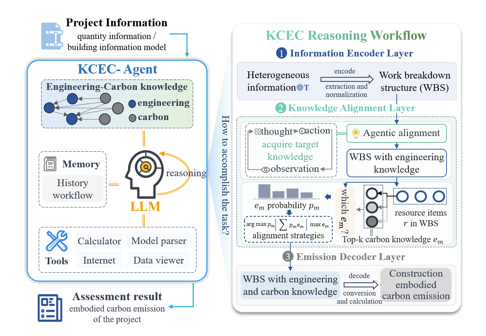

<div align="center">
  <p align="center">    </p>

<p align="center"><b>Carbon Pilot (CPi)</b></p>
<p align="center">
  AI-powered embodied carbon quantification, visualization, and knowledge reasoning system for construction projects
</p>

<p align="center">
  <span style="
    border:1px dashed #d0d7de;
    border-radius:6px;
    padding:6px 14px;
    font-size:14px;
  ">
    <a href="README.md"><b>English</b></a>
    &nbsp;|&nbsp;
    <a href="docs/README_CN.md"><b>中文</b></a>
  </span>
</p>

<p align="center">
  <a href="https://opensource.org/licenses/MIT">
    
  </a>
  <a href="https://www.python.org/downloads/">
    
  </a>
  <a href="https://nodejs.org/">
    
  </a>
  <a href="https://nextjs.org/">
    
  </a>
</p>


## 🌱 Introduction

**CarbonPilot** is an intelligent, knowledge-augmented agent system designed for **embodied carbon quantification in construction projects**. By combining **knowledge graphs**, **large language models (LLMs)**, and **interactive visualization**, CarbonPilot enables automated carbon calculation, traceable reasoning, and conversational analysis across heterogeneous engineering data sources. CarbonPilot is intended for researchers and practitioners working on construction carbon assessment, sustainability analysis, and AI-assisted decision support.


## ✨ Key Capabilities

- **🧮 One-Click Carbon Calculation**  
  Automatically parse and process heterogeneous engineering documents and project data

- **📊 Interactive Result Visualization**  
  Dynamic charts and graphs for embodied carbon analysis and comparison

- **💬 AI-Powered Dialogue**  
  Conversational interaction with LLMs to interpret calculation results and decision logic

- **🕘 Historical Data Management**  
  Track project histories, carbon records, and analysis evolution over time

- **⚙️ Flexible Configuration**  
  Configurable databases, LLM parameters, embeddings, and agent behaviors


## 🎬 Demo

The demo showcases the end-to-end workflow of **CarbonPilot**, including project data ingestion, embodied carbon calculation, and interactive result visualization through agent-driven reasoning.

<p align="center">    </p>


## 🧱 System Architecture

<p align="center">    </p>

The system is built around a **CarbonPilot–centric architecture**, where an LLM-driven agent integrates **engineering–carbon knowledge**, **memory**, and **tool invocation** to reason over construction projects. Heterogeneous project information is first encoded into a **Work Breakdown Structure (WBS)**, then aligned with engineering and embodied carbon knowledge through an agentic reasoning workflow, and finally decoded to produce **construction embodied carbon emission assessments**.


## 🖥️ System Requirements

- **Python 3.13+**
- **Node.js 16+**
- **Docker** (required for Neo4j graph database)


## 🚀 Installation

### 1️⃣ Backend Environment Setup

From the project root directory:

```bash
python -m venv venv
source venv/bin/activate   # Windows: venv\Scripts\activate
pip install -r requirements.txt
```

This installs all required backend Python dependencies.


### 2️⃣ Frontend Dependencies

Navigate to the frontend directory:

```bash
cd web
npm install
```

This installs all frontend dependencies for the web interface.


### 3️⃣ Graph Database Initialization

The system uses **Neo4j** as its graph database, running in Docker.

For first-time setup, initialize the system using:

```bash
python init.py
```

This script will:

- Start the Neo4j Docker container
- Initialize knowledge graphs and embodied carbon factor datasets

>**Additional note:**
> During initialization, the system will use the **embedding model specified in the `.env` file**.
> By default, the embedding model is **`qwen3-embedding`**, deployed via **Ollama**.
> Please ensure that the configured embedding model is properly set up and available before running the initialization.


## ▶️ Usage

After successful initialization, launch the system:

```bash
python start.py
```

During startup, the system will automatically:

- Start the backend API services
- Launch the frontend web application

Once running, access the system via:

```bash
http://localhost:3000
```

> **Usage note:**
>  Before starting any analysis, please configure the **LLM model and selection strategy** in the **Settings panel (top-right corner of the web interface)**.
>
> **Note on Reproducibility:**  
> Due to the involvement of LLM-based reasoning, some components may exhibit non-deterministic behavior across runs.


## 📂 Repository Structure

```
CarbonPilot/
├── assets/                     # Project assets (logos, figures, demo media)
│
├── configs/                    # Configuration wrappers
│                               # (LLM, embeddings, Neo4j, system parameters)
│
├── knowledge_graph/            # Knowledge graph construction and processing
│   ├── cef/                    # Carbon Embodied Factor (CEF) knowledge modules
│   └── quota/                  # Quota-related querying and utility modules
│
├── schemes/                    # Data models and project information schemas
│
├── server/                     # Backend services and business logic
│   └── routes/                 # API route definitions
│
├── static/                     # Static files, intermediate cache, and outputs
│   ├── extraction_cache/       # Cache for extracted document information
│   ├── quota_cache/            # Cache for quota-related data
│   └── result/                 # Generated calculation results and outputs
│
├── tests/                      # Test scripts and test cases
│                               # (unit tests, integration tests)
│
├── utils/                      # Shared utility functions and helpers
│
├── web/                        # Frontend application (Next.js)
│   ├── app/                    # Next.js App Router
│   ├── components/             # Reusable React components
│   └── utils/                  # Frontend utility functions
│
├── init.py                     # System initialization script
│                               # (Neo4j startup, knowledge graph initialization)
│
├── start.py                    # Main application launcher
│                               # (backend + frontend startup)
│
├── prompts.py                  # Prompt templates for LLM interaction
│
└── README.md                   # Project documentation

```


## ⚙️ Configuration Overview

CarbonPilot supports multiple LLM backends (cloud-based or local).  
Please ensure that the selected backend matches the required capabilities for the configured carbon factor selection mode.


## ⚠️ Note

The **probability-based selection mode** requires the LLM API to provide **logit or token probability outputs**.
 If the LLM backend does **not** support probability information (e.g., **Ollama**), please use the **Highest Similarity** mode instead.


## 📄 License

This project is licensed under the **MIT License**. See the [LICENSE](LICENSE) file for details.